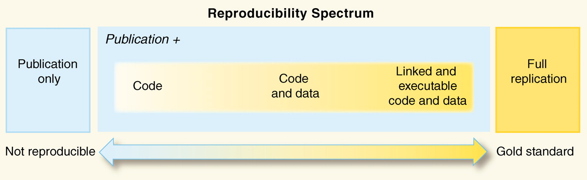

```{r, cache=FALSE, include=FALSE}
source("config/setup_knitr.R")
library(RefManageR)
BibOptions(check.entries = FALSE,
           bib.style = "authoryear",
           cite.style = "authoryear",
           style = "markdown",
           hyperlink = FALSE,
           dashed = FALSE)
bib <- ReadBib("config/refs.bib", check = FALSE)
xaringanExtra::use_xaringan_extra("tachyons")
```

# Outline

<br>

.pull-left[
What I expect you to know by the end of this talk

- What is the general data science workflow
- Know what are the tools available for the data scientist
]
.pull-right[
What you'll definitely not know by the end

- How to use any of this tools
  - Sorry, we would need a few days for that
]


---
class: center, middle, inverse
# Let's start with a failure

---
# The Duke trial saga

.pull-left[

Anil Potti *et al*: A Genomic Strategy to Refine Prognosis in
Early-Stage Non–Small-Cell Lung Cancer. *The New England Journal of
Medicine*. 2006.

- Prediction of lung cancer evolution

Anil Potti *et al*: Genomic signatures to guide the use of
chemotherapeutics. *Nature Medicine*. 2006.

- "Best" chemotherapy to cancer patients
]
.pull-right[
- Duke researchers started **three clinical trials**
- Researchers from **MD Anderson Cancer Centre** tried to apply the new
  technique, with no success
- They found several problems in Duke's group data
- After investigation, the clinical trials had to be closed
- It turned out that one of the authors was involved with the biomedic
industry
]

.footnotesize[
- [An array of errors](https://www.economist.com/node/21528593). The
  Economist, 2011.
- [How Bright Promise in Cancer Testing Fell
  Apart](https://www.nytimes.com/2011/07/08/health/research/08genes.html).
  The New York Times, 2011.
]

---
class: center, middle, inverse
# How to avoid this type of failure

---
# Avoiding failures

.pull-left[
- Know what you're doing
- Know the **question** being asked
- Know the **type of question** being asked
- Know how to **approach** the question
- Know the **methods** to answer the question
- Know the **tools** to develop the methods
- Know how to **communicate** the results
- Know how to make the results **reproducible**
- Know how to **share** the results
]
.pull-right[
- **Adopt a workflow**
  - There are lots of them
  - Stick with one and go for it
  - There's no "best" workflow

- **Use appropriate methods**
  - *Data science as art*

- **Use the appropriate tools**
  - Automate everything
  - Version control your files
  - Use software that improves reproducibility
]

---
class: center, middle, inverse
# Types of questions

---
# Types of questions

> Mistaking the type of question being considered is the most common error
in data analysis (Leek & Peng, 2015)

<br>

Any specific data analysis can be broadly classified into one of six
types:

1. Descriptive
2. Exploratory
3. Inferential
4. Predictive
5. Causal
6. Mechanistic

---
# Types of questions (Leek & Peng, 2015)

```{r, out.width='55%'}

```

---
class: center, middle, inverse
# Data Science workflows

---
# Data Science workflows

.pull-left[
- Data analysis **is not** a linear, one-step-after-the-other process

- Data analysis **is** a highly iterative and non-linear process

- Information is learned at each step
  - Informs whether (and how) to refine, the step that was just
performed
  - Informs whether (and how) to proceed to the next step

]
.pull-right[
There are 5 core activities of data analysis:

1. Stating and refining the question
2. Exploring the data
3. Building formal statistical models
4. Interpreting the results
5. Communicating the results
]

---
# Epicycle workflow (Peng & Matsui, 2018)

.pull-left[

For each of the 5 core activities, the following steps are critical

1. Set expectations
2. Collect data, and compare with expectations
3. Revise expectations or fix the data

Iterating through this 3-step process is called the **epicycle of data
analysis**

<!-- As you go through every stage of an analysis, you will need to go -->
<!-- through the epicycle to continuously refine your question, your -->
<!-- exploratory data analysis, your formal models, your interpretation, and -->
<!-- your communication. -->

]
.pull-right[
```{r, out.width='70%'}

```
]

---
# Harvard workflow (Pfister, Blitzstein, Kaynig)

.pull-left[
<br>
<br>
- Basically the same thing (but in "clouds" instead of "wheels")

- All the others are just variants of these
]

.pull-right[
```{r, out.width='90%'}

```
]


---
# Box, Hunter & Hunter (2005) feedback loop ("workflow")

<br>

```{r, out.width='60%'}
knitr::include_graphics("img/feedback-loop.png")
```

---
class: center, middle, inverse
# Data analysis as art

---
# Data analysis as art

> *Science is knowledge which we understand so well that we can teach it
to a computer*.
> *Everything else is art.*

> Donald Knuth, 1974

.pull-left[

- An analyst's data analysis can be compared to a songwriter's
  composition

- The methods were already taught to the computer

- We have the tools and the theory, but is up to each analyst to decide
  how to put things together

- That's the "spark of creativity", and that may not be easy to describe
]

.pull-right[
```{r, out.width='60%'}
knitr::include_graphics("img/knuth.jpg")
```
]


---
class: center, middle, inverse
# Tools for a collaborative workflow


---
# Tools for a collaborative workflow


The key tools are the ones that makes all the steps **reproducible** by
  **anyone** in your team

<br>

.pull-left-40[
1. Make it reproducible to you first!

2. Make it reproducible to your team

3. Make it reproducible to anyone else
]
.pull-right-60[
> *A scientific project is *computationally reproducible* if another
researcher (**including the future you**) is able to recreate all the
results, given only a set of files and instructions.*

> Justin Kitzes (2018)
]


---
# Replicability vs reproducibility

.pull-left[
## Replication
```{r, out.width='80%'}
knitr::include_graphics("img/replication.png")
```
]

.pull-right[
## Reproduction
```{r, out.width='80%'}
knitr::include_graphics("img/reproduction.png")
```
]


---
# Reproducibility spectrum

- But, replicability is **hard**! (Sometimes even **impossible**!)

- So, we have two options

  1. Do nothing
  2. Reproduce the study

- The general idea is to create a **minimum standard** for judging
scientific claims ([Peng, 2011,
*Science*](http://science.sciencemag.org/content/334/6060/1226.full))


```{r, out.width='70%', echo=FALSE}

```

---
# Reproducibility in science

<br>

If we already know the result, then why?

- Pattern for judging scientific claims

- Validate a data analysis

- Different views of the methods (thar art part)

- Avoid duplicated effort

- Improves team work


---
class: center, middle, inverse
# Elements of reproducibility

---
# Elements of reproducibility

.pull-left-60[
1\. **Data**
  - Must be provided the exact same way it was used in the analysis
  - If raw data was processed, both the raw data and the script that
  processed it must be provided

2\. **Code**
  - This automatically excludes point-and-click software
  - It must be executable all at once
  - If there are sets of files, then you need something to assure that
    they will be executed in the correct order
  - Make sure that all needed packages/software are installed (possibly
    in specific versions)
]
.pull-right-40[
3\. **Documentation**
  - Describe to humans what the code is doing (don't make people guess)
  - Describe the results

4\. **Distribution**
  - This could be to you, to your team, to your boss, or to the World
  - Share in a way that anyone can download and reproduce it
]


---
exclude: true
# Tools for reproducibility

## Publicar dados e códigos não é necessariamente uma tarefa trivial

.pull-left[
### Problemas comuns

- Muitos autores simplesmente "colocam" arquivos na *web*.
- Existem jornais que disponibilizam materiais suplementares, mas que
  sabidamente são desorganizados ou falhos.
- Mesmo quando dados e códigos estão disponíveis, o leitor ainda tem que
  baixar dados e códigos, e então tentar juntar tudo, uma tarefa que
  geralmente não é fácil e desencoraja a maioria das pessoas.
- O leitor pode não ter os mesmos recursos computacionais que o
  autor.

]
.pull-right[
Algumas dicas para ajudar a tornar um projeto reproduzível:

1. Documente tudo!
2. Tudo é um arquivo (de texto)
3. Todos os arquivos devem poder ser lidos por humanos
4. Organize e "amarre" seus arquivos de forma apropriada
5. Tenha um plano para organizar, armazenar, e tornar seus arquivos
   disponíveis

]

---
class: center, middle, inverse
# Tools for reproducibility

---
# Tools for reproducibility

.pull-left-60[
<br>
<br>
```{r, echo=FALSE, out.width='90%'}

```
]

.pull-right-40[
[Nature, 2018](https://www.nature.com/articles/d41586-018-05990-5)

- Use code
- Go open-source
- Track your versions
- Document your analyses
- Automate
- Replicate your environment
- Archive your data
- Get help. [Software Carpentry](https://software-carpentry.org/).
]

---
# Track your versions: What it isn't

.pull-left[
### Cloud Storage

- Dropbox
- Google Drive
- MS One
- And many others

]
.pull-right[
```{r, out.width='80%'}

```
]

---
# Track your versions: What it is

.pull-left[
### Version Control Systems (VCS)

- Git
- Subversion (SVN)
- Mercurial
- And many others

Use hosting servers to share and collaborate

- GitHub
- Gitlab
- Bitbucket
- And many others

]
.pull-right[
```{r, out.width='80%'}
knitr::include_graphics("img/git-flow.png")
```
]

---
# Document your analyses: use dynamic documents

.pull-left-60[
- This concept dates back to 1984, when Donald Knuth (again) defined
  (and actually invented) what **literate programming** is
- It is a combination of a **markup language** (LaTeX, Markdown, HTML,
  etc) and one (or several) **programming languages**
  - Yes, you can mix R, Python, Bash, C, etc in the same document!
- When the document is compiled, the code is executed and you get an
  output (PDF, HTML, etc) with tables, figures, ...
]
.pull-right-40[
<br>
> *Instead of imagining that our main task is to instruct a computer what
> to do, let us concentrate rather on explaining to humans what we want
> the computer to do.*
>
> Donald Knuth, 1984
]

---
# Document your analyses: use dynamic documents

.pull-left-40[
- **Sweave**
  - It's in R since the beginning of times
  - Allows only LaTeX as markup language
  - Only R as programming language
- **knitr**
  - Allows other markup languages (Markdown, HTML)
  - Allows many (14+) programming languages

]
.pull-right-60[
- **rmarkdown**
  - The "workhorse" is still knitr
  - Powered by [Pandoc](https://pandoc.org/), a universal document
    converter
  - It is Pandoc that actually produces the final outputs in different
    formats
  <!-- - There are many variations of rmarkdown: bookdown, blogdown, -->
  <!--   thesisdown, etc -->
- **Quarto**
  - Is a stand-alone software for scientific publishing
  - Built on Pandoc, with many ideas borrowed from rmarkdown
  - Makes dynamic documents widely available, as it does not rely only
    in R and R packages
]

---
# Automate: two types of automation

.pull-left[
### Code level
- Create scripts for pre-processing data
- Create functions to execute repetitive tasks
  - Bash (Shell Linux/Unix) is your friend here
- Create a routine to run scripts in a specific order
  - Create a [MAKEFILE](https://opensource.com/article/18/8/what-how-makefile)
]

.pull-right[
### Deploy level
- Use Continuous Integration (CI) or Continuous Delivery (CD) platforms
to automate, test and deploy your project
- Your routines will run in an external, pristine environment to avoid
the famous
   - "*but it works on my computer*..."
- Some examples:
  - Github Actions
  - Gitlab CI
  - Travis CI
]

---
# Replicate your environment

.pull-left[
**Virtual environments**

- Makes a project self-contained (or almost) in terms of packages
- Easy to use and record all packages used and **in their specific versions**
- Recorded packages are downloaded and installed in the first use
  - In R: `renv`
  - In Python: `venv`
]

.pull-right[
**Container virtualisation**

- Virtualisation of an environment at the **operating system** level
- Containers are isolated from each other and can have their own
  software in any specific version
- [Docker](https://www.docker.com/) is the main tool
]

**In the reproducibility spectrum:**
.center.content-box-purple[
Script < Script+Data < renv < Docker < renv+Docker
]

---
# Replicate your environment: renv

.pull-left[
### The problem
<br>
```{r, out.width='80%'}
knitr::include_graphics("img/shared-library.png")
```
]
.pull-right[
### The solution
<br>
```{r, out.width='80%'}
knitr::include_graphics("img/package-cache.png")
```
]

---
# Replicate your environment: containers

<br>

```{r, out.width='80%'}
knitr::include_graphics("img/containers.jpg")
```

---

```{r, out.width='40%'}

```

---
# Archive your data

Use **data repositories** to share data (and get the proper credits)

- [figshare](https://figshare.com/)
  - Allows you to publish figures, tables, videos, data, etc.
  - Everything gets a **DOI** (Digital Object Identifier), so it can be
  cited
- [zenodo](https://zenodo.org/)
  - Publish text and data
  - Also has DOI and link researchers with [Orcid](https://orcid.org/).
- [Nature recommended data
  repositories](https://www.nature.com/sdata/policies/repositories)
  - Compilation of several repositories
- [re3data](https://www.re3data.org/)
  - *REgistry of REsearch Data REpositories* is a tool to search for
    open access databases


---
class: center, middle, inverse
# Don't panic!

---
# Start by reproducing this slides

https://github.com/fernandomayer/y-isa

<br>

```{r, out.width='40%'}

```

---
# Summary

- Track your versions
  - Git and Github
- Document your analyses
  - Dynamic documents
- Automate
  - Functions, scripts and MAKEFILE
- Replicate your environment
  - renv and/or Docker
- Archive your data
  - Zenodo/Figshare

---
class: center, middle, inverse
# Thanks!
